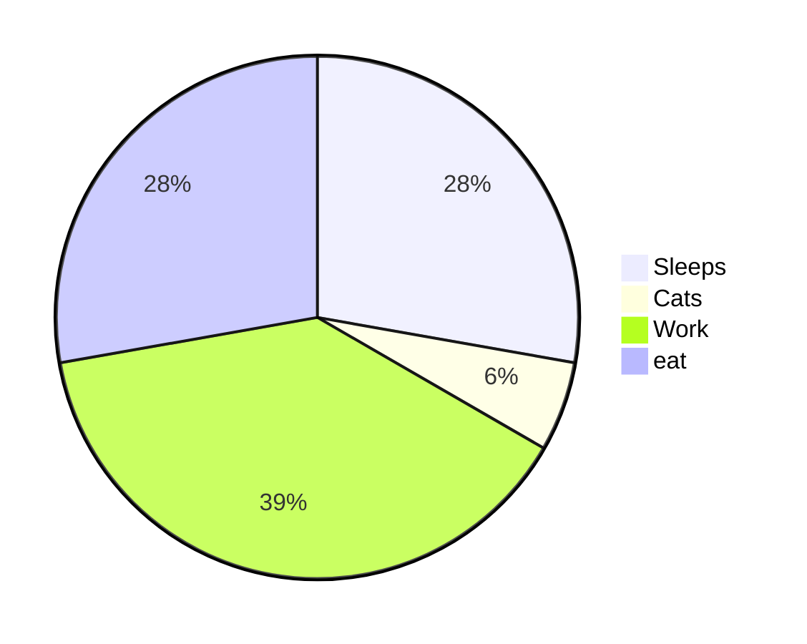
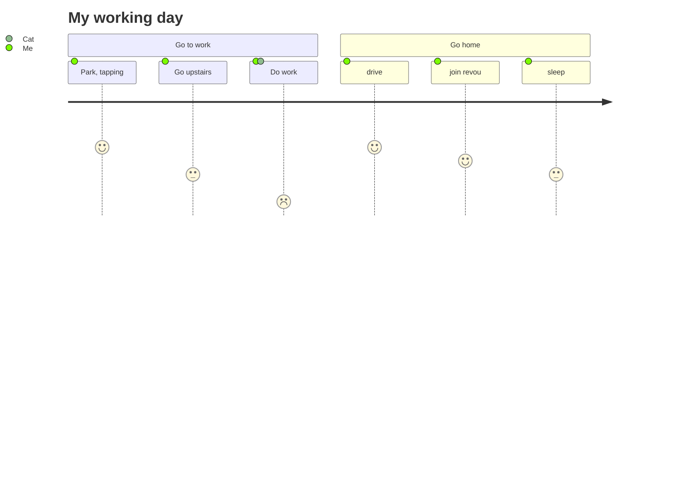
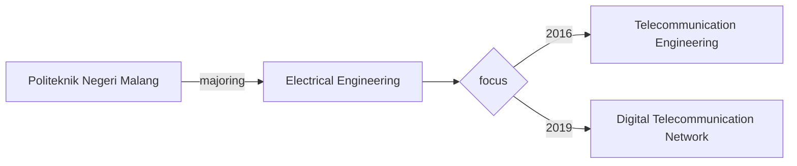
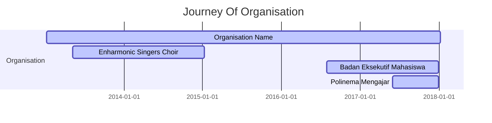

<header style ="text-align: center; background-color:rgb(0,5,45); padding-top: 2px;
    padding-bottom: 2px;top:0;left:0;width:100%">
      <h1 style= "font-size: 20px;text-transform: uppercase; color:white">Dhea Fiky Fatchatur Rizky</h1>
      <p style=" font-size: 18px; color:white; font-weight: 700;">
      Software Engineer</p>
</header>

## <center>Hi, Everyone :wave:</center>
*******
Tables of contents  
 1. [My Short profile?](#shortProfile)
 2. [See my Livfe Cycle?](#lifeCycle)
 3. [See my educational background](#educationBackground)
 4. [See my organisational Experience](#organisation)
 5. [Work Experience](#workExperience)
 6. [Let's Talk About Code](#code)

*******
<div id='shortProfile'/>  

## Welcome to My Short Profile 👩‍💻

<p align="center">
  
</p>

><center>This is My first assignment at <color>Revou</color>on MileStone 00</center>
<div class="text-justify">
I'm a junior Software Engineer from Malang, Indonesia. Graduated from **D3 Telecommunication Engineering** in 2019 and continued to **D4 Digital Telecommunication Network** study program majoring in Electrical Engineering with the Cumlaude predicate in 2020. Awarded as outstanding student in 2019 majoring in telecommunications engineering. Have experience in various company such as telecommunication company and logistic. Have a good negotiation skills and analytic about data to report and give the best analysis. And Now, for getting more knowledge and insight from the competent and experienced people, I'm joined at <span style="color:orange;font-weight: 700">Revou Software Engineering Full Stack</span>.
</div>

## Let's being friend's

[](https://www.linkedin.com/in/dhearizky/)

---

<div id='lifeCycle'/>  

# My Life Cycle

- Life Cycle that will always repeat
   ```mermaid
     graph TD;
         sleep --> eat;
         sleep --> Code;
         eat --> prayer;
         Code --> prayer;
   ```




---

   <div id='educationBackground'/> 

# Educational Background

---
   <div id='organisation'/> 

# Organisational Experience



---
  <div id='workExperience'/> 

## Work Experience :zap: 👩‍🏫

| Company       | Experience      | Tahun |
| ------|-----|-----|
|PT. Promanufacture |Internship at Software Engineering Divition, learn about F.L.O i8 product and how read the code base of the product using C#, learn signal R, learn Factory design pattern, learn ASP.NET WEB APP MVC |March - June 2023|
| PT. HM. SAMPOERNA Sukorejo 	| Create and Monitoring PO (purchase order) PR (purchase request, and GR (good receipe) on SAP netweaver and Coupa)	| Jul 2021 - March 2023 	|
| PT. Indonesia Comnet Plus (PLN ICON+) Balikpapan  	| Internship at Activation Divition:  Helping user monitoring every installation project carried out by partner companies,create Purchase ORder, Purchase Requisition and Good Receipe in SAP, Following discussion with partner companies for installation activities, Learning about product on ICON+ such like metronet, and business flow  	| March - April 2021	|
| PT. POCA JARINGAN SOLUSI (Surabaya)	| Input data from network installation such as 4G, 4G LTE networks, sector antenna switches, or microwave antenna switches of Telkomsel provider that have been completed in the field at Huawei ISDP platform 	| Jun - July 2021	|
| PT. POCA JARINGAN SOLUSI (Surabaya) 	| Internship at Installation BTS : BTS (base transceiver station) design and radio components with autocad, Help Installation of new and existing BTS on the field, Commisioning BTS until ON AIR, Following troubleshooting of network errors at the Jombang site sector 1, compiling Huawei ATP documents for indosat provider	| Aug - Sept 2019	|
|PT. Ruang Raya Indonesia (RUANGGURU)|Work As Mathematic tutor and MAth Assosiate Teacher Freelance as SBMPTN intensive program mathematics teacher, Mathematic teacher package for PAKET C program, Math tutor for senior high school program, Selection question banks in the system database to be displayed in the application|2017 - present|
---
  <div id='code'/> 

# Let's Talk About Code
## I have learned several languages
 * 
```java
public class HelloWorld 
{
  public static void main(String[] args) 
  {
      System.out.println("Hello, World!");
  }
}
```
 * 

```html
<!DOCTYPE html>
<html lang="en">
<head>
    <meta charset="UTF-8">
    <meta name="viewport" content="width=device-width, initial-scale=1.0">
    <title>Hello, World!</title>
</head>
<body>
    <h1>Hello, World!</h1>
</body>
</html>
```
* 
```css
<!DOCTYPE html>
<html>
<head>
<style>
.center_div 
{
  border: 1px solid gray;
  margin-left: auto;
  margin-right: auto;
  width: 90%;
  background-color: #d0f0f6;
  text-align: left;
  padding: 8px;
  }
 </style>
 </head>
 <body>

<div class="center_div">
  <h1>Hello World!</h1>
</div>

</body>
</html>

```
* 
```javascript
console.log("Hello, World!");
```
* 
```C
#include <stdio.h>

int main() {
    printf("Hello, World!\n");
    return 0;
}
```
* 

```csharp

using System;

class Program
{
  static void Main()
  {
    Console.WriteLine("Hello World");
  }
}
```
  > I also learn class diagram when learning C#, because it use OOP (Object Oriented Programming) model
   ```mermaid
   classDiagram
       class Car{
        -weight
        -Color
        -model
        -makeYear
        -fuelType
         +drive()
         +park()
         +stop()
         +Accelerate()
       }
   ```
* 
```c++
#include <iostream>

int main() {
    std::cout << "Hello, World!" << std::endl;
    return 0;
}
```
* 
```python
print ("Hello, World!")
```
* 
```R
# This is a comment in R
x <- c(1, 2, 3, 4, 5)
mean_x <- mean(x)
print(mean_x)
```
* 
## What is markdown ?  
According to Wikipedia :  

  >*Markdown is a lightweight markup language with plain text formatting syntax designed so that it can be converted to HTML and many other formats using a tool by the same name. Markdown is often used to format readme files, for writing messages in online discussion forums, and to create rich text using a plain text editor.*   


`SIMPLY: IT'S JUST ANOTHER TYPE OF TEXT FILE, LIKE .txt .doc ....( now it's .md :laughing:) AND IT HAS SOME SPECIAL SYNTAX.`  
<div id='why'/>  

## Why use markdown?
Because it's :
 * **EZ** : The syntax is so easy that you can learn in a minute or two then write without noticing anything weirdo  or geeky.
 * **FAST** : It saves time compared to other types of text files/formats. It helps boost the productivity and workflows of writer.
 * **CLEAN** : Both the syntax and output are clean, not messy with our eyes and simple to manage.
 * **FLEXIBLE** : With just a little set-up, your text will be translated cross any platform out there, editable in any text-editing software and convertible to a wide array of formats.

**In short**, normal users will find it useful in any cases, especially when you are in need of something better than plain text but less functional than Microsoft Word.  
**For Developers**, if you are lazy to write HTML code , you will love markdown. **Moreover**, **Github** and many sites favor markdown for readme file of projects. That means you gonna meet markdown in your life one way or another.  
<div id='tools'/>  

# Key of Ask and Reading 

## This site really help my progress for going to be software engineer
*  
```diff
+ Asking everything you want to ask related your issue for code

```
* 

```diff
 ! Got everything what you want for the course but it not interactive yet
```
*	
```diff
 Got everything what you want for the course but it not interactive yet
```
*	
```diff
+ Read How Tech is grow is awesome

```
* 
```diff
+ Asistant in your hand? How awesome

```
* 
```diff
+ Ask, browsing, Debug? we can do both in here

```


# Other Tools
## I also learn for theese tools because it will help for the work
*  

  >*Postman is an API platform for building and using APIs. Postman simplifies each step of the API lifecycle and streamlines collaboration so you can create better APIs—faster.It offers a simple user interface for making HTML requests, without going through the hassle of writing a lot of code just to test the API functionality.*
* 
  >*Git is a distributed version control system that is widely used in software development. Which means it helps in tracking changes in files and directories over time. It allows multiple developers to collaborate on a project, keeping track of who made which changes, and when.*
* 
  >*GitHub is a web-based platform that provides a variety of tools and services for software developers. It serves as a platform for version control using Git, as well as a hub for collaborative software development.8
* 
  >*GitLab is a web-based platform that provides a comprehensive set of tools for software development and project management. Similar to GitHub, GitLab is used for version control using Git, but it also offers a range of features beyond basic version control.*
* 
  >*MySQL is an open-source relational database management system (RDBMS) that is widely used for storing, managing, and retrieving data. It is known for its speed, reliability, and ease of use. MySQL is a popular choice for web-based applications and is often used in conjunction with scripting languages like PHP.
* 
  >*SQLite is a software library that provides a relational database management system (RDBMS) embedded into applications. Unlike traditional database management systems like MySQL or PostgreSQL, SQLite is not a standalone server, but rather, it is a self-contained, serverless, and zero-configuration library.


