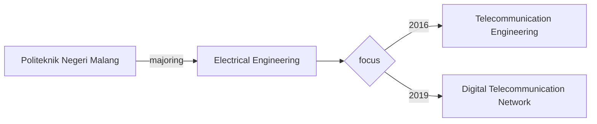
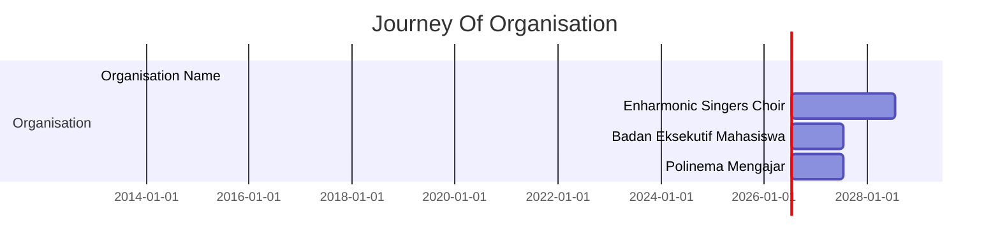

<header style ="text-align: center; background-color:rgb(52,52,55); padding-top: 2px;
    padding-bottom: 2px;top:0;left:0;width:100%">
      <h1 style= "font-size: 20px;text-transform: uppercase; color:white">Dhea Fiky Fatchatur Rizky</h1>
      <p style=" font-size: 18px; color:white; font-weight: 700;">
      Software Engineer</p>
</header>

## <center>Hi, Everyone :wave:</center>
---
## Welcome to My Short Profile 👩‍💻

<p align="center">
  
</p>

><center>This is My first assignment at <color>Revou</color>on MileStone 00</center>
<div class="text-justify">
I'm a junior Software Engineer from Malang, Indonesia. Graduated from **D3 Telecommunication Engineering** in 2019 and continued to **D4 Digital Telecommunication Network** study program majoring in Electrical Engineering with the Cumlaude predicate in 2020. Awarded as outstanding student in 2019 majoring in telecommunications engineering. Have experience in various company such as telecommunication company and logistic. Have a good negotiation skills and analytic about data to report and give the best analysis. And Now, for getting more knowledge and insight from the competent and experienced people, I'm joined at <span style="color:orange;font-weight: 700">Revou Software Engineering Full Stack</span>.
</div>

---
# Educational Background

---
# Organisational Experience


---
## Work Experience :zap: 👩‍🏫

| Company       | Experience      | Tahun |
| ------|-----|-----|
|PT. Promanufacture |Internship at Software Engineering Divition, learn about F.L.O i8 product and how read the code base of the product using C#, learn signal R, learn Factory design pattern, learn ASP.NET WEB APP MVC |March - June 2023|
| PT. HM. SAMPOERNA Sukorejo 	| Create and Monitoring PO (purchase order) PR (purchase request, and GR (good receipe) on SAP netweaver and Coupa)	| Jul 2021 - March 2023 	|
| PT. Indonesia Comnet Plus (PLN ICON+) Balikpapan  	| Internship at Activation Divition:  Helping user monitoring every installation project carried out by partner companies,create Purchase ORder, Purchase Requisition and Good Receipe in SAP, Following discussion with partner companies for installation activities, Learning about product on ICON+ such like metronet, and business flow  	| March - April 2021	|
| PT. POCA JARINGAN SOLUSI (Surabaya)	| Input data from network installation such as 4G, 4G LTE networks, sector antenna switches, or microwave antenna switches of Telkomsel provider that have been completed in the field at Huawei ISDP platform 	| Jun - July 2021	|
| PT. POCA JARINGAN SOLUSI (Surabaya) 	| Internship at Installation BTS : BTS (base transceiver station) design and radio components with autocad, Help Installation of new and existing BTS on the field, Commisioning BTS until ON AIR, Following troubleshooting of network errors at the Jombang site sector 1, compiling Huawei ATP documents for indosat provider	| Aug - Sept 2019	|
|PT. Ruang Raya Indonesia (RUANGGURU)|Work As Mathematic tutor and MAth Assosiate Teacher Freelance as SBMPTN intensive program mathematics teacher, Mathematic teacher package for PAKET C program, Math tutor for senior high school program, Selection question banks in the system database to be displayed in the application|2017 - present|
---

# Let's Talk About Code
## I have learned several languages
 * 
```java
public class HelloWorld 
{
  public static void main(String[] args) 
  {
      System.out.println("Hello, World!");
  }
}
```
 * 

```html
<!DOCTYPE html>
<html lang="en">
<head>
    <meta charset="UTF-8">
    <meta name="viewport" content="width=device-width, initial-scale=1.0">
    <title>Hello, World!</title>
</head>
<body>
    <h1>Hello, World!</h1>
</body>
</html>
```
* 
```css
<!DOCTYPE html>
<html>
<head>
<style>
.center_div 
{
  border: 1px solid gray;
  margin-left: auto;
  margin-right: auto;
  width: 90%;
  background-color: #d0f0f6;
  text-align: left;
  padding: 8px;
  }
 </style>
 </head>
 <body>

<div class="center_div">
  <h1>Hello World!</h1>
</div>

</body>
</html>

```
* 
```javascript
console.log("Hello, World!");
```
* 
```C
#include <stdio.h>

int main() {
    printf("Hello, World!\n");
    return 0;
}
```
* 

```csharp

using System;

class Program
{
  static void Main()
  {
    Console.WriteLine("Hello World");
  }
}


```
* 
```c++
#include <iostream>

int main() {
    std::cout << "Hello, World!" << std::endl;
    return 0;
}
```
* 
```python
print ("Hello, World!")
```
* 
```R
# This is a comment in R
x <- c(1, 2, 3, 4, 5)
mean_x <- mean(x)
print(mean_x)
```
* 

# Key of Ask and Reading 

## This site rreally help my progress for going to be software engineer
* 
* 
*	
*	
* 
* 


# Other Tools
## I also learn for theese tools because it will help for the work
* 
* 
* 
* 
* 
* 
* 


```
``python
print("hello world!")
``

## Flavored V1

<div style="background-color: rgb(50, 50, 50);">

``python
print("Yo!")
``

</div>
```


# Markdown Tutorial 
  

## Hello, welcome to my tutorial for markdown. 👋
In this tutorial you will learn the most basics things about Markdown. 👩‍🏫👨‍🏫

- Spanish version available [here](https://github.com/LewisVo/Markdown-Tutorial/blob/master/Translation:Spanish.md) 🇪🇸.
- Portuguese version available [here](https://github.com/LewisVo/Markdown-Tutorial/blob/master/README_pt-BR.md) 🇵🇹.
- French version available [here](https://github.com/luongvo209/Markdown-Tutorial/blob/master/README_fr.md) 🇫🇷.

*******
Tables of contents  
 1. [What is Markdown?](#whatismarkdown)
 2. [Why use Markdown?](#why)
 3. [Tools for Markdown](#tools)
 4. [Markdown Syntax](#syntax)

*******

<div id='whatismarkdown'/>  

## What is markdown ?  
According to Wikipedia :  

  >*Markdown is a lightweight markup language with plain text formatting syntax designed so that it can be converted to HTML and many other formats using a tool by the same name. Markdown is often used to format readme files, for writing messages in online discussion forums, and to create rich text using a plain text editor.*   


`SIMPLY: IT'S JUST ANOTHER TYPE OF TEXT FILE, LIKE .txt .doc ....( now it's .md :laughing:) AND IT HAS SOME SPECIAL SYNTAX.`  
<div id='why'/>  

*There is no clearly defined Markdown standard. This has led to fragmentation as different vendors write their own variants of the language to correct flaws or add missing features.. A list of markdown flavour is available [here](https://github.com/jgm/CommonMark/wiki/Markdown-Flavors).*

From now, this guide will mainly focus on Github Flavoured Markdown.

## Why use markdown?
Because it's :
 * **EZ** : The syntax is so easy that you can learn in a minute or two then write without noticing anything weirdo  or geeky.
 * **FAST** : It saves time compared to other types of text files/formats. It helps boost the productivity and workflows of writer.
 * **CLEAN** : Both the syntax and output are clean, not messy with our eyes and simple to manage.
 * **FLEXIBLE** : With just a little set-up, your text will be translated cross any platform out there, editable in any text-editing software and convertible to a wide array of formats.
<br></br>
**In short**, normal users will find it useful in any cases, especially when you are in need of something better than plain text but less functional than Microsoft Word.  
**For Developers**, if you are lazy to write HTML code , you will love markdown. **Moreover**, **Github** and many sites favor markdown for readme file of projects. That means you gonna meet markdown in your life one way or another.  
<div id='tools'/>  

## Tools for markdown
As said above, any editors can be used to edit markdown. However, there are a few tools that may be useful for you when it comes to edit markdown.
 * **[*Stackedit*](https://stackedit.io)** : Ok, you can stop reading right now. Click the link then start your markdown tour in an eziest way ever. Just type normal text then use your mouse, click click done. You dont have to know the syntax.  It's good, but it will make you reliant and most developers prefers keyboards.
 * **[*Dillinger*](http://dillinger.io/)** : Online tool, support live view (split screen) and export to html. Nothing too special but very neat and handy.
 * **[*Typora*](https://www.typora.io/)** : Available for Mac and Windows, minimal, distraction free, live view seemlessly, bundled with a lot of other stuffs like Images, Lists, Tables, Code Fences, Math Blocks, YAML, Front Matters,Toc,...
 * **[*Atom*](https://atom.io/)** : popular hackable text editor (you may be using this). Yeah, this is versatile. Markdown Support? Just a part of it but is greatly built in.
 * **[*Minimalist Markdown*](https://chrome.google.com/webstore/detail/minimalist-markdown-edito/pghodfjepegmciihfhdipmimghiakcjf?hl=en)** : Chrome app. Works everywhere if you have Chrome installed ( this is my favorite one).
 * **[*Macdown*](http://macdown.uranusjr.com/)** : best for Mac.
 * **[*MarkdownPad*](http://markdownpad.com/)** : best for Windows.
 * **[*Remarkable*](https://remarkableapp.github.io/)** : best for Linux. 
 * **[*GITBOOK*](http://www.gitbook.com/)** : GitBook is a modern publishing toolchain. Making both writing and collaboration easy. It does both support Markdown and have a close relation with the beloved Github.
<div id='syntax'/>  

## Markdown Syntax  
All Syntax can be found [here](https://daringfireball.net/projects/markdown/syntax) . It would take a lot of effort to describe syntax in text (they will be formatted) so please consider this table below for the whole basics syntax.  

| Format        | Syntax      | Example |
| ------|-----|-----|
| Italic  	| \*Text\* 	| *This is italic* 	|
| Bold  	| \*\*Bold\*\* 	| **This is bold** 	|
| Inline links 	| \[Description text\](url here) 	| A [link](http://www.github.com) 	|
| Images 	| \ 	| An image  	|
| Link+images 	| \[\\](url to a page)\] 	| Click me [](https://www.youtube.com) 	|
| Footnotes  	| I have more \[^1\] to say.   \[^1\]: say it down here. 	| <a href="#section1">Hey,Please read the note below this table.  	|
| Line breaks 	| Double space + enter 	|  	|
| Unordered Lists 	| \* Item1     \*Item 2 	| <ul><li>item1</li><li>item2</li><li>item3</li><li>item4</li></ul> 	|
| Ordered Lists 	| 1. Item a    2. Item b 	| <ol><li>itema</li><li>itemb</li><li>itemc</li><li>itemd</li></ol>  	|
| Mixed Lists 	| 1. Item 1      * item 1a 	|  <ol><li>itema</li></ol><ul><li> item1</li></ul>	|
| Block quote 	| \> Quoted text 	|  <blockquote>Stay Hungry Stay Foolish</blockquote> 	|
| Preformatted 	| Begin each line with,two spaces or more to,make text look,e x a c t l y,like,you,type i,t. 	|   Begin each line with,two spaces or more to,make text look,e x a c t l y,like,you,type i,t. 	|
| Code 	| \`Insert Code\` 	| `cout<<"Hello world";` 	|
| Code block/ Syntax highlighting 	| \`\`\`insert code\`\`\` 	|  <a href="#section1">Hey,Please read the note below this table. 	|
| Headers 	| \#, \##, \###, \####, \#####, \###### (from h1 to h6) 	|  <h3>This is a h3 header</h3>	|
| Strike through 	| \~~Insert text here\~~ 	| ~~I am dead~~ 	|
| Tables 	| \| Tables   \|      Are      \|  Cool \| \|\----------\|\:\-------------\:\|------\:\| \| col 1 is\|  left-aligned \| $1600 \| |  |
|Footnotes| Footnote[\^1\] <br> [\^1\]: Text reference | Here is a simple footnote[^1]. With some additional text after it. | 
[^1]: My footnote reference.
 
<br></br>
 <br></br>
 <p id="section1">Note: **Footnote** actually doesnt render properly in table, but it kinda looks like this </p>  
 
   
   <br></br>
   The same goes for **block code/syntax hightlighting**. It kinda looks like this picture :
  
.    

These characteristics are dependent upon each markdown flavour.  


## Useful notes  :
 * Markdown allows you to use backslash escapes to generate literal characters which
would otherwise have special meaning in Markdown’s formatting syntax. One commonly used backslash escape character is : \     
 `So? \*This\* isnt italic  anymore but is surrounded by literal asterisks.`

 * Youtube videos require some additional work. 
  ```
  They can't be added directly but you can add an image with a link to the video like this:
  <a href="http://www.youtube.com/watch?feature=player_embedded&v=YOUTUBE_VIDEO_ID_HERE
  " target="_blank"></a>
  ```
 * Markdown does support Emojii :laughing: :laughing: :kissing_heart: :innocent: :green_heart: ( get some emojies [here](http://www.emoji-cheat-sheet.com/) )
 * You can use \<br/> tag to force line break. 
 * Double space then enter if you want to make a new line if there is trouble making new lines.
 * Seeing is not as good as practicing. You can either create a markdown file for yourself to practice or do it online [here](http://www.markdowntutorial.com).
 *  Footnotes and syntax highlighting are not part of the original markdown and are only supported by certain flavors of markdown (Feedback from [Sean Brody](https://goo.gl/ASZwEn))
 *  Any URL (like http://www.github.com/) will be automatically converted into a clickable link.  
 *  Markdown table support is designed to handle most tables for most people; it doesn’t cover all tables for all people. If you need complex tables you will need to create them by hand or with a tool specifically designed for your output format.
 *  Using image and links, you can create some colorful assets at render time. Badges like this are typical examples that you can find all over Github  [](https://github.com/)  [](https://github.com/)
[](https://github.com/)
[](https://github.com/) 
[](https://www.linkedin.com/)
[](https://github.com/)
( get some badges [here](https://shields.io/) )

* Using code block syntax with diff language to generate colored text. There are still some limitations such as can not style the text inside and few colors. This can be applicable when you want to highlight some note or to show difference between two code block

```diff
- text in red
+ text in green
! text in orange
# text in gray
@@ text in purple (and bold)@@
```


* Add beautiful note or warning section into markdown GitHub:
> **Note**:

> **Warning**:

* In markdown file on Github, with code block syntax and Mermaid language specifed, we can draw many kinds of diagram. More syntax and sample diagrams [here](https://mermaid-js.github.io/)

  - Class diagram
   ```mermaid
   classDiagram
       class Duck{
        -weight
         +swim()
         +quack()
       }
   ```
  - Sequence diagram
   ```mermaid
   sequenceDiagram
       participant dotcom
       participant iframe
       dotcom->>iframe: loads html w/ iframe url
   ```
  - Flowchart
   ```mermaid
     graph TD;
         A-->B;
         A-->C;
         B-->D;
         C-->D;
   ```

###### Author: *Vo Tran Thanh Luong*. Also, I would like to thank all the contributors/translators for your work making this greater.
   